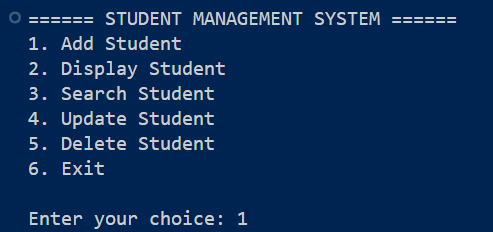
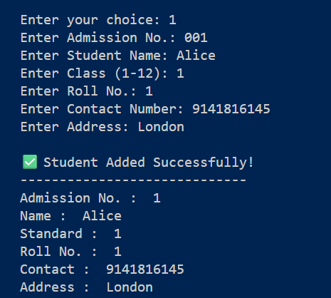
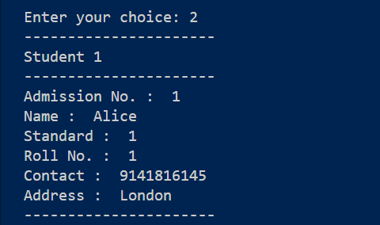

# 🎓 Student Management System (Python)
A console-based Student Management System developed in Python that allows users to manage student records efficiently using CRUD operations and JSON file storage.

## ✨ Features
- ➕ Add Student
- 📋 Display All Students
- 🔍 Search Student
- ✏️ Update Student Details
- 🗑️ Delete Student
- 💾 JSON File Storage
- ✅ Input Validation
- ⚠️ Exception Handling
- 🚫 Duplicate Admission Number Check
- 🚫 Duplicate Roll Number Check (within same class)

## 🛠️ Technologies Used
- Python 3
- JSON
- File Handling

## 📂 Project Structure
```
Student-Management-System-Python/
│── Student_management.py
│── students.json
│── README.md
│── .gitignore
```

## ▶️ How to Run
1. Clone the repository
2. Open the project in VS Code
3. Run:

```bash
python Student_management.py
```

## 📸 Screenshots

### Main Menu


### Add Student


### Display Students


## 📌 Future Improvements
- Login System
- SQLite Database
- GUI using Tkinter
- Export Data to CSV
- Attendance Management

## 👨‍💻 Author
*Ummesalamah Parawala*<br>
⭐ If you found this project useful, consider giving it a star.